# QAVPN Infrastructure Architecture Diagram

```mermaid
graph TB
    %% Client Applications
    subgraph "Client Environment"
        APP1[Web Browser]
        APP2[SSH Client]
        APP3[Other Apps]
        SOCKS[SOCKS Proxy<br/>Port 9050]
        
        APP1 --> SOCKS
        APP2 --> SOCKS
        APP3 --> SOCKS
    end

    %% QAVPN Client
    subgraph "QAVPN Client"
        CLIENT[QAVPN Client<br/>Post-Quantum Crypto]
        CONFIG[Config File<br/>~/.qavpn/config]
        DIRECT_MODE[Direct Mode<br/>Port 9052]
        
        SOCKS --> CLIENT
        CONFIG --> CLIENT
        CLIENT --> DIRECT_MODE
    end

    %% Bootstrap Network (qavpn.net)
    subgraph "Bootstrap Network - qavpn.net"
        BS1[bootstrap1.qavpn.net:9051]
        BS2[bootstrap2.qavpn.net:9051]
        BS3[bootstrap3.qavpn.net:9051]
        
        style BS1 fill:#e1f5fe
        style BS2 fill:#e1f5fe
        style BS3 fill:#e1f5fe
    end

    %% Multi-hop Relay Network
    subgraph "Multi-hop Relay Network"
        RELAY1[Relay Node 1<br/>Entry Point]
        RELAY2[Relay Node 2<br/>Middle Hop]
        RELAY3[Relay Node 3<br/>Exit Point]
        RELAY4[Relay Node 4<br/>Alternative Path]
        RELAY5[Relay Node 5<br/>Alternative Path]
        
        style RELAY1 fill:#f3e5f5
        style RELAY2 fill:#f3e5f5
        style RELAY3 fill:#f3e5f5
        style RELAY4 fill:#f3e5f5
        style RELAY5 fill:#f3e5f5
    end

    %% Docker Infrastructure
    subgraph "Docker Deployment"
        DOCKER[Docker Compose<br/>qavpn-relay:latest]
        CONTAINER[Hardened Container<br/>User: 65532:65532]
        VOLUMES[Volumes<br/>Config & Logs]
        HEALTH[Health Check<br/>Status Monitoring]
        
        DOCKER --> CONTAINER
        CONTAINER --> VOLUMES
        CONTAINER --> HEALTH
        
        style DOCKER fill:#fff3e0
        style CONTAINER fill:#fff3e0
    end

    %% Direct Connection Mode
    subgraph "Direct P2P Network"
        PEER1[Peer 1<br/>Direct Connection]
        PEER2[Peer 2<br/>Direct Connection]
        PEER3[Peer 3<br/>Direct Connection]
        INVITE[Invitation System<br/>Secure Key Exchange]
        
        style PEER1 fill:#e8f5e8
        style PEER2 fill:#e8f5e8
        style PEER3 fill:#e8f5e8
        style INVITE fill:#e8f5e8
    end

    %% External Services
    subgraph "External Services"
        DNS1[Cloudflare DNS<br/>1.1.1.1]
        DNS2[Cloudflare DNS<br/>1.0.0.1]
        TARGET[Target Servers<br/>Internet Services]
        
        style DNS1 fill:#fce4ec
        style DNS2 fill:#fce4ec
        style TARGET fill:#fce4ec
    end

    %% Cryptographic Layer
    subgraph "Cryptographic Engine"
        KYBER[CRYSTALS-Kyber-1024<br/>Post-Quantum Key Exchange]
        AES[AES-256-GCM<br/>Symmetric Encryption]
        HKDF[HKDF Key Derivation<br/>golang.org/x/crypto]
        PFS[Perfect Forward Secrecy<br/>Session Keys]
        
        style KYBER fill:#fff8e1
        style AES fill:#fff8e1
        style HKDF fill:#fff8e1
        style PFS fill:#fff8e1
    end

    %% Connection Flows
    
    %% Bootstrap Discovery
    CLIENT -.->|"Bootstrap Discovery"| BS1
    CLIENT -.->|"Bootstrap Discovery"| BS2
    CLIENT -.->|"Bootstrap Discovery"| BS3
    
    %% Multi-hop Routing (3-5 hops)
    CLIENT -->|"Encrypted Tunnel"| RELAY1
    RELAY1 -->|"Hop 1→2"| RELAY2
    RELAY2 -->|"Hop 2→3"| RELAY3
    RELAY3 -->|"Exit Traffic"| TARGET
    
    %% Alternative paths
    CLIENT -.->|"Alternative Path"| RELAY4
    RELAY4 -.->|"Alt Hop"| RELAY5
    RELAY5 -.->|"Alt Exit"| TARGET
    
    %% Direct Connections
    CLIENT <-->|"P2P Direct"| PEER1
    CLIENT <-->|"P2P Direct"| PEER2
    CLIENT <-->|"P2P Direct"| PEER3
    DIRECT_MODE --> INVITE
    
    %% Docker Relay Deployment
    CONTAINER -->|"Relay Service<br/>Port 9051"| RELAY1
    CONTAINER -->|"Auto-connect"| BS1
    
    %% DNS Resolution
    CLIENT --> DNS1
    CLIENT --> DNS2
    
    %% Cryptographic Integration
    CLIENT --> KYBER
    CLIENT --> AES
    CLIENT --> HKDF
    CLIENT --> PFS
    
    RELAY1 --> KYBER
    RELAY2 --> KYBER
    RELAY3 --> KYBER
    
    %% Security Features Annotations
    classDef security fill:#ffebee,stroke:#d32f2f,stroke-width:2px
    classDef crypto fill:#fff8e1,stroke:#f57f17,stroke-width:2px
    classDef network fill:#e3f2fd,stroke:#1976d2,stroke-width:2px
    classDef bootstrap fill:#e1f5fe,stroke:#0277bd,stroke-width:2px
    
    class KYBER,AES,HKDF,PFS crypto
    class BS1,BS2,BS3 bootstrap
    class CLIENT,RELAY1,RELAY2,RELAY3 network
```

## Architecture Components

### 1. Bootstrap Network (qavpn.net)
- **Primary Domain**: `qavpn.net`
- **Bootstrap Nodes**: 3 hardcoded discovery servers
- **Function**: Initial peer discovery and network entry

### 2. Multi-hop Relay Architecture
- **Minimum Hops**: 3 relay nodes
- **Maximum Hops**: 5 relay nodes
- **Protocols**: TCP/UDP support
- **Security**: Each hop uses independent encryption

### 3. Direct Connection Mode
- **P2P Architecture**: Direct peer-to-peer connections
- **Port**: 9052 (configurable)
- **Invitation System**: Secure key exchange for peer authentication
- **OPSEC Features**: Enhanced operational security

### 4. Cryptographic Infrastructure
- **Post-Quantum**: CRYSTALS-Kyber-1024 key exchange
- **Symmetric**: AES-256-GCM encryption
- **Key Derivation**: HKDF with secure context
- **Forward Secrecy**: Session-based key rotation

### 5. Docker Deployment
- **Hardened Container**: Security-focused configuration
- **Resource Limits**: CPU and memory constraints
- **Non-root User**: UID/GID 65532
- **Health Monitoring**: Automated status checks

### 6. Network Security Features
- **Traffic Analysis Resistance**: Packet sharding and noise injection
- **Timing Protection**: Random delays (10-100ms)
- **DNS Privacy**: Cloudflare DNS (1.1.1.1, 1.0.0.1)
- **Fail-secure Design**: Secure error handling

## Data Flow

1. **Client Applications** → SOCKS Proxy (Port 9050)
2. **QAVPN Client** → Bootstrap Discovery (qavpn.net)
3. **Multi-hop Routing** → 3-5 Encrypted Relay Hops
4. **Exit Traffic** → Target Internet Services
5. **Alternative**: Direct P2P connections bypass relay network

## Security Layers

- **Application Layer**: SOCKS proxy integration
- **Transport Layer**: Post-quantum encrypted tunnels
- **Network Layer**: Multi-hop routing with traffic analysis resistance
- **Physical Layer**: Distributed relay infrastructure
